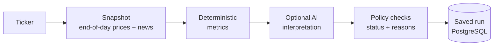

# Vantage

**A research assistant for US stocks that shows its work.**

Enter a ticker and Vantage builds an end-of-day research record for that company: measured price behaviour, recent news, an optional AI-written summary, and an honest account of how good the underlying data was. Every number can be traced back to the inputs that produced it, and every run is saved so you can reopen it later.

**Live demo:** [vantage-six-coral.vercel.app](https://vantage-six-coral.vercel.app)

> Vantage is a research tool. It does not give investment advice, recommend trades, or place orders.

## Why it exists

Most AI stock tools give a confident answer with no way to check it. You can't tell which prices it used, whether the news was a week old, or whether the model simply made a number up.

Vantage is built the other way round. The numbers come from deterministic calculations, not from a model. The AI step may only interpret evidence it was given, may not introduce figures of its own, and is optional. When data is missing or stale, the result says so instead of quietly filling the gap.

Every result answers:

- What did Vantage observe, and which metrics support it?
- Which prices and news items were used, and how current were they?
- Was anything missing, stale, partial, or failed?
- Which model, prompt, and code versions produced it?
- What is its run ID, so it can be reopened later?

## What a research run contains

| Part | What you get |
|---|---|
| **Metrics** | 1-, 5- and 20-session returns, 20-session annualized volatility, maximum drawdown, average dollar volume, and counts of the price and news data used |
| **Research status** | `informational`, `review`, `insufficient_data`, or `failed`, never "buy" or "sell" |
| **Data quality** | An overall rating, plus separate ratings for prices and news (`fresh`, `partial`, `stale`, `missing`, `failed`) and for the model (`healthy`, `degraded`, `failed`, `not_run`) |
| **Reasons and warnings** | Registered, machine-checkable reasons for the status, not free text |
| **Evidence** | The news sources used, with publisher and timestamp |
| **AI interpretation** | Optional. A news sentiment label and a short summary that cites the evidence it relies on. The model may decline to answer when the evidence is too thin |
| **Versions** | The workflow, metrics, policy, response schema, prompt, model, and code versions that produced the run |

If the price data is unusable, the run says `insufficient_data` and the model is not called at all. If only the news or the model fails, the metrics are kept and the run is marked for `review`.

## How it works



1. **Snapshot.** Prices and news for the ticker are fetched once and stored, so every later step works from the same inputs.
2. **Metrics.** Calculated from that snapshot with plain code, so the same snapshot always gives the same numbers.
3. **Interpretation.** If a model provider is configured, it writes a short summary. Its output is checked and discarded if it contains numbers, cites evidence it was not given, or uses advisory or predictive language.
4. **Policy.** Assigns the research status and reasons from the metrics and data quality.
5. **Saved run.** The whole record is stored against your account and can be reopened from your history.

Each run also emits an OpenTelemetry trace (optionally exported to Langfuse), so an engineer can follow a run ID through every step.

## What it is not

- Not investment advice, a recommendation engine, or a signal service
- No portfolio construction, position sizing, backtesting, or forecasting
- No trading, broker integration, or order placement
- No intraday or real-time data; US-listed equities at end of day only

## Tech stack

| Layer | Technology |
|---|---|
| Frontend | React 19, TypeScript, Vite, Tailwind CSS 4, TanStack Query |
| Backend | Python 3.12, FastAPI, LangGraph, SQLAlchemy 2, Alembic |
| Database | PostgreSQL 17 |
| Accounts | First-party email and password: Argon2id, short-lived JWTs, rotating refresh cookies, email verification and password reset |
| AI models | Gemini, Groq, or a local Ollama model; or none at all |
| Market data | yfinance (development and research use) |
| Email | Any SMTP server (Gmail with an app password by default), or Brevo |
| Observability | OpenTelemetry, Langfuse |
| Hosting | Vercel (frontend) and Heroku (backend and database) |
| Testing | pytest, Vitest, Testing Library, Playwright |

## Project status

Vantage is under active development.

- **Research runs:** working end to end, from ticker to saved, reopenable result.
- **Accounts:** first-party sign-up, sign-in, email verification, and password reset, replacing the earlier hosted auth provider.
- **Planned areas** such as portfolio and risk views appear in the navigation as disabled placeholders.

## Quick start

You need Docker with Compose v2.

```bash
git clone https://github.com/RMx-03/Vantage.git
cd Vantage
cp .env.example .env
```

Open `.env` and set `AUTH_JWT_SECRET` and `TELEMETRY_USER_SALT` to two different random values (`openssl rand -hex 32` makes one). Then:

```bash
docker compose up --build
```

Open [http://localhost:5173](http://localhost:5173) and create an account. Locally no email is sent, so mark the account verified before running research. See [Email in local development](#email-in-local-development) for the one-line command.

By default no AI model is used: runs contain metrics and evidence only. To add an interpretation, set `LLM_PROVIDER` to `gemini` or `groq` with its API key in `.env`, or use a local Ollama model (below).

## Repository layout

| Path | Contents |
|---|---|
| [`backend/`](backend/) | FastAPI API, research workflow, accounts, email, database migrations. See [backend/README.md](backend/README.md). |
| [`frontend/`](frontend/) | React app: landing page, sign-in, research terminal, run history, settings. See [frontend/README.md](frontend/README.md). |
| `docker-compose.yml` | The local stack: PostgreSQL, migrations, backend, frontend, optional Ollama. |
| `heroku.yml` | Backend container build and release-phase migration for Heroku. |

---

## Running locally in detail

Compose reads its configuration from the `.env` file in the **repository root**, not from `backend/.env` or `frontend/.env`.

The backend refuses to start if `AUTH_JWT_SECRET` or `TELEMETRY_USER_SALT` is missing, shorter than 32 bytes, or looks like a placeholder. A running API with a weak signing secret would issue forgeable tokens, so this is deliberate.

`docker compose up --build` starts PostgreSQL 17, creates separate migration-owner and runtime database roles, applies migrations, and starts the API at `http://localhost:8000` and the frontend at `http://localhost:5173`. The default database passwords are for development only.

To use a local Ollama model, start the `local` profile and set `LLM_PROVIDER=ollama` in `.env`:

```bash
docker compose --profile local up --build
```

`docker compose down` stops everything and keeps your data. `docker compose down -v` also deletes local accounts, research history, and Ollama models.

### Email in local development

By default `EMAIL_PROVIDER=noop`: the backend records that an email would have been sent and sends nothing. The link itself is not logged, because a link in a log file can be used by anyone who reads it.

To verify a local account without email:

```bash
docker compose exec postgres psql -U vantage_owner -d vantage -c \
  "UPDATE vantage_auth.users SET email_verified_at = now() WHERE email = 'you@example.com';"
```

Use the address in lowercase, then sign out and back in.

To send real email through a Gmail account, add these to `.env` and restart the backend (`docker compose up -d backend`):

| Variable | Value |
|---|---|
| `EMAIL_PROVIDER` | `smtp` |
| `SMTP_HOST` | `smtp.gmail.com` |
| `SMTP_PORT` | `587` |
| `SMTP_USERNAME` | The Gmail address, such as `you@gmail.com` |
| `SMTP_PASSWORD` | A Google **app password** (Google Account → Security → 2-Step Verification → App passwords). Never the account password. |
| `EMAIL_FROM` | `Vantage <you@gmail.com>`, the same address; Gmail rewrites any other sender to the account |
| `APP_BASE_URL` | Where links in emails point; `http://localhost:5173` locally |

Use a Gmail account dedicated to the app, not a personal one. A free account can send to 500 recipients a day. Any other SMTP server works the same way, and Brevo is also supported (`EMAIL_PROVIDER=brevo` with `BREVO_API_KEY`).

Test only with addresses you control. Sending to disposable inboxes looks like abuse to any email provider.

### Troubleshooting

**The backend exits at startup.** Run `docker compose logs backend`. The startup check names the setting at fault, for example `AUTH_JWT_SECRET must be at least 32 bytes; refusing to start.` Fix it in `.env` and run `docker compose up -d backend`.

**`role "vantage_runtime" does not exist`.** The database creates its runtime role from `backend/docker/postgres/init-runtime-role.sh`. If your clone has Windows (CRLF) line endings, that script fails silently. Fix it once, then recreate the database volume with `docker compose down --volumes`:

```bash
git add --renormalize . && git checkout -- backend/docker/postgres/init-runtime-role.sh
```

## Deployment

The frontend runs on Vercel and the backend on Heroku. Vercel forwards `/api/*` to the Heroku app, so the browser only ever talks to one site and the sign-in cookie stays first-party.

Heroku builds the backend from `backend/Dockerfile` via `heroku.yml`, and runs database migrations in the release phase before the new version starts. Behind Vercel and Heroku, set `TRUSTED_PROXY_HOPS=2` so rate limits apply to each real visitor rather than to the proxy. [backend/README.md](backend/README.md) lists the full configuration.

## Continuous integration

Every push runs four jobs:

- **Backend Tests & Quality Gates.** Tests, lint, formatting, type checks, and an 85% coverage gate against a real PostgreSQL 17 database.
- **Frontend Tests, Lint & Build.** Dependency audit, unit tests with coverage, lint, a design-system check, and a production build.
- **Mocked Browser Journey.** A Playwright run of the user journey against the development server, with the API mocked. This tests what the user sees, not the backend.
- **Production Container Smoke Test.** Builds the production images, migrates a fresh database, and checks the following:
  - the database grants nothing to the public role and the runtime role cannot change the schema (these role checks hold only where two roles exist, in Compose and CI; production's Essential-tier database has one credential);
  - the backend answers its health check;
  - the frontend serves its routes.

  It then replays the mocked browser journey against the running containers.

CI never contacts a market-data, AI, email, or tracing provider. Checking behaviour against real providers is done by hand.
